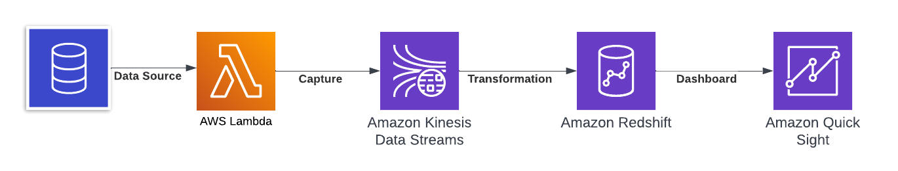

# Temus - case study

## Case study statement

There is a page that publishes eCommerce data about products provided by various vendors.
The page is updated in random intervals. Data sources can be found here:
https://temus-northstar.github.io/data_engineering_case_study_public/
• The customer (ElectroWorld) wants an overview so they can inspect it aggregated in near
real-time. Ideally, the customer needs to define their own dynamic prices.
You are expected to:
• Create a data pipeline that will ensure regular updates in data storage.
• Run some reasonable aggregations.
• Publish the outcomes as a website or as a dashboard.
Outcomes
• GitHub with the application code and README describing the solution components.
Nice to have:
• URL with a running application
• You can shine by carefully selecting the most appropriate service and tools.
• You can impress with performance and cost optimisation.
• You can enrich the data with ML techniques (trends, anomalies, clusters).
• You can build a dashboard instead of a tabular representation.
• The preferred deployment is in AWS, but you can choose other options.
• You can improve the delivery with a data catalogue, data quality monitoring, or similar best
practices.

## MVP AWS Architecture

I've implemnted basic AWS architecture to perform following:

- simulate streaming using Lambda function together with Kinesis stream
- design simple data model and process data in Redshift warehouse
- create mockup dashboard using QuickSight

The following diagram describes MVP architecture:



### AWS Lambda

- used to simulate input for Kineses Data stream
- downloads current state from provided web page
- for demo purposes data are slightly adjusted to avoid constant data for multiple snapshots:
  - sale price is randomly increased for randomly selected observations
  - Stock Status is also adjusted
- lambda function were for simplicity triggered several times manually 
- lambda function definition can be found in subfolder lambda together with corresponding AWS SAM templates

### Amazon Kinesis Data Stream

- for both data stream Kinesis stream is defined
- previously defined Lambda function push current data extracts to the streams
- stream definition (AWS CloudFormation templates) is specified in kinesis subfolder and can be deployed the following command:

```
KINESIS_STACK=YourRedshiftDataStreamProduct
ENV=staging
aws \
cloudformation deploy \
--template-file kinesis/kinesis-temus-product-data.yaml \
--stack-name $KINESIS_STACK \
--capabilities CAPABILITY_IAM \
--parameter-overrides \
"Environment"=$ENV
```

### Redshift

Data from Kinesis streams are stored and processed in Redshift data warehouse. The simple 3 layer model was defined:


- bronze layer:
  - raw data from streams stored as materialized views
- silver layer:
  - cleaned data
  - firstly payload column (super data type containing json obtained from web page with data) is splitted into individual columns
  - in next step data are cleaned (invalid values are moved in to quarantine table - in this case invalid data are specified by one category to similate real world situation when we would set constraints on allowed values in data). Moreover columns are converted to correct data types
- gold layer:
  - contains 3 views with aggregated infromation that can be loaded into dashboard

Remark: SQL scripts used to define views are stored in redshift subfolder.

Remark: materialized view needs to be refreshed manually. In production the referesh could be orchestrated to fulfil business needs.

### QuickSight

QuickSight was used to create basic dashboard that visualise tables available in gold layer.

## Potential improvements

### Enhanced AWS Architecture

The implemnted archicture suits as an illustration of MVP solution. For real life problem the architecture would need to be enhanced to provide more robust, scalable and performant solution.

The current solution lacks following:

- connection to real streaming source
- autoscaling of cloud resorces
- more advanced data model
- regular orchestration (Step Function, Airflow)
- monitoring (alerts)
- data catalog
- data quality controls

The following diagram illustrates how archicecture could be enahnced:

### Other considerations

- consider multiple environments (dev/test/prod)
- deploy between enviuronments via cicd pipeline
- autoscaling of resources
- incorporate also Vendor data source
- moreover another streaming or batch data sources could be included
- validate choose of dashboarding tool
- facilitate usage of ML model on top of the data (e.g. dynamic pricing)
- cloud agnosticity
- testing
